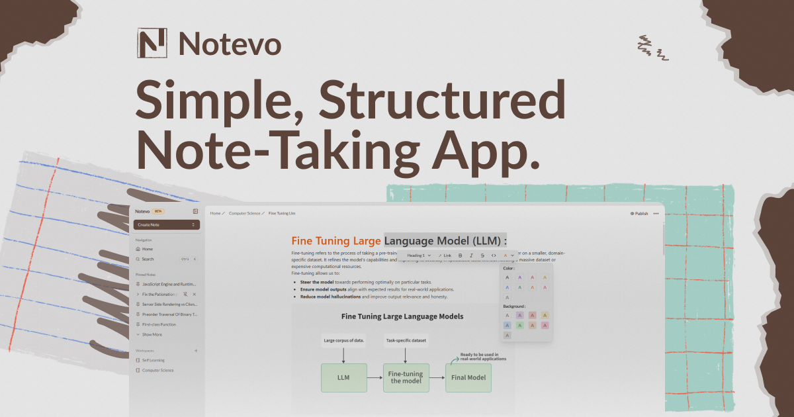

# Notevo

> A minimal, structured note-taking app — simpler than Notion, more organized than Google Keep.

[](https://notevo.me)
[](https://www.mohammedh.dev/)
[](https://www.linkedin.com/company/notevo)
[](https://github.com/notevome/Notevo)
[](mailto:support@notevo.me)

I built Notevo because I couldn't find a note-taking app that hit the sweet spot: clean and focused, but still powerful enough to organize real work. Notevo gives you a rich Notion-style editor, workspaces, tables, whiteboards, PDF storage, link saving, and AI — without the bloat.



---

## Features

### Workspaces and Organization

- **Workspaces** — Top-level containers for your projects (star, rename, or manage access).
- **Tables** — Group notes, PDFs, links, and whiteboards neatly inside any workspace.
- **Drag-and-drop reordering** — Reorder notes smoothly within tables using `@hello-pangea/dnd`.
- **Searchable Move Dialog** — Move notes, links, PDFs, or tables across different workspaces and tables.
- **Favorites & Pinning** — Star notes, whiteboards, links, or PDFs for instant access.
- **Human-friendly URLs** — Clean, slug-based routing for workspaces and nested items.

### Rich Text Editor

- **Notion-style block editor** — Powered by TipTap and Novel.
- **Drag handle** — Grab and reorder blocks easily.
- **Full table support** — Insert tables with headers, rows, and resizable cells.
- **Code syntax highlighting** — Highlighted code blocks using lowlight and Shiki themes.
- **Table of contents** — Automatically generated heading structure.
- **Typography & styling** — Bold, italic, underline, highlight colors, and text alignment.
- **Inline media & blocks** — Task lists, blockquotes, images, and links.
- **Adjustable width** — Switch note reading view between narrow, standard, and wide.
- **Auto-save & pending drafts** — Debounced real-time saving and quick instant note creation.

### AI Assistant

- **Contextual AI selector** — Select text to trigger smart commands:
  - Improve writing
  - Fix grammar
  - Make shorter / Make longer
  - Continue writing
  - Custom instruction prompt
- Powered by OpenAI via the Vercel AI SDK.
- Abuse protection with Upstash rate limiting.

### Mention System

- Type `@` anywhere in the editor to reference and link internal notes, PDFs, whiteboards, or saved links.
- Scoped search with workspace and table breadcrumb previews.
- Full keyboard navigation and caching support.

### Link Saver & Rich Bookmarks

- Save links from YouTube, X (Twitter), LinkedIn, Instagram, or any website.
- Automatic metadata extraction: thumbnails, authors, viewer metrics, and descriptions.
- Kept organized right beside your notes in workspace tables.

### Whiteboard Canvas

- Infinite whiteboard canvas powered by Excalidraw.
- Real-time cloud persistence with Convex so boards stay synchronized across devices.
- Automatic theme adaptation for dark and light modes.
- Snapshot preview generation for quick visual browsing.

### PDF Storage and Reader

- Direct PDF file uploads to workspaces and tables.
- Built-in reader powered by `@anaralabs/lector` and `pdfjs-dist`.
- Stored safely in Convex cloud storage.

### Multi-Format Note Export

Export notes into standard file formats:

| Format        | Extension | Output                               |
| ------------- | --------- | ------------------------------------ |
| Markdown      | `.md`     | Clean plain text markdown            |
| JSON          | `.json`   | TipTap document abstract syntax tree |
| Word Document | `.docx`   | Microsoft Word formatted file        |
| PDF           | `.pdf`    | Printable document                   |

### Public Sharing & Social Previews

- One-click publishing toggle to share read-only notes publicly.
- Public document view at `/public/document/[id]`.
- Dynamic Open Graph images and Twitter card generation via `@vercel/og`.

### Global Search & Command Palette

- Quick keyboard-accessible modal search across all content types.
- Scans titles and contents with normalized fuzzy matching.
- Immediate jump-to navigation with path breadcrumbs.

### Folder Drop Upload

- Drag-and-drop entire local folders into the app.
- Automatically processes and maps directories and PDFs into workspaces and tables.

### Dashboard & Analytics

- Activity bar chart via Recharts tracking creation habits over time.
- Overview metrics for workspaces, total items, and pinned favorites.

### Theming and System UX

- Theme switcher supporting dark, light, and system preferences via `next-themes`.
- Fluid skeleton loading UI across sidebars, tables, and note editors.
- Toast notifications with Sonner for feedback.
- Split-pane and resizable layouts.

---

## Tech Stack

| Layer                  | Technology                                                            |
| ---------------------- | --------------------------------------------------------------------- |
| **Framework**          | Next.js 16 (App Router, Turbopack)                                    |
| **Language**           | TypeScript                                                            |
| **Styling**            | Tailwind CSS, Radix UI, Framer Motion                                 |
| **Backend & Database** | Convex (Real-time DB, file storage, serverless functions)             |
| **Authentication**     | Convex Auth (GitHub, Google, Resend Magic Link, Resend OTP, Password) |
| **Editor**             | TipTap, Novel                                                         |
| **Canvas**             | Excalidraw                                                            |
| **PDF Processing**     | pdfjs-dist, @anaralabs/lector                                         |
| **AI Integration**     | OpenAI, Vercel AI SDK                                                 |
| **Email Service**      | Resend, React Email                                                   |
| **Rate Limiting**      | Upstash Ratelimit, Vercel KV                                          |
| **Export Engines**     | docx, jspdf, html2pdf.js, Turndown                                    |
| **Testing**            | Vitest, Testing Library, jsdom                                        |
| **Hosting**            | Vercel                                                                |

---

## Getting Started

### Prerequisites

- Node.js 18+
- pnpm (or npm)
- Convex CLI (`npx convex`)

### Installation

```bash
git clone https://github.com/notevome/Notevo.git
cd Notevo
pnpm install
```

### Environment Variables

Create a `.env.local` file in the root directory:

```env
# Convex
CONVEX_DEPLOYMENT=your_convex_deployment_id
NEXT_PUBLIC_CONVEX_URL=https://your-deployment.convex.cloud
CONVEX_SITE_URL=https://your-deployment.convex.site
SETUP_SCRIPT_RAN=false

# OAuth Providers
AUTH_GITHUB_ID=your_github_client_id
AUTH_GITHUB_SECRET=your_github_client_secret
AUTH_GOOGLE_ID=your_google_client_id
AUTH_GOOGLE_SECRET=your_google_client_secret

# Email (Resend)
AUTH_RESEND_KEY=re_your_resend_api_key
AUTH_EMAIL=hello@yourdomain.com

# Site URL
SITE_URL=https://notevo.me
```

### Running Locally

Run both the Next.js frontend and Convex backend in parallel:

```bash
pnpm dev
```

Visit [http://localhost:3000](http://localhost:3000) in your browser.

---

## Testing

Run unit and integration tests with Vitest:

```bash
pnpm test           # Watch mode
pnpm test:run       # Single run (CI)
pnpm test:coverage  # Coverage report
pnpm test:ui        # Vitest UI
```

---

## Project Structure

```
Notevo/
├── app/                        # Next.js App Router
│   ├── (shere)/public/         # Public shared note view
│   ├── api/og/                 # Dynamic Open Graph banner generator
│   ├── home/                   # Main dashboard, workspaces & item views
│   └── signup/                 # Authentication
├── components/
│   ├── generative/             # AI selector & completion actions
│   ├── home-components/        # Sidebar, modals, search, dashboards
│   ├── mention/                # @mention TipTap extension
│   ├── selectors/              # Formatting toolbars (colors, tables, links)
│   ├── landingPage-components/ # Landing page & footer
│   └── ui/                     # UI components & primitives
├── convex/                     # Convex backend functions & schema
│   ├── schema.ts               # Database schema
│   ├── auth.ts                 # Auth configuration
│   ├── notes.ts                # Notes queries & mutations
│   ├── whiteboards.ts          # Excalidraw scenes
│   ├── pdfs.ts                 # PDF storage & handlers
│   ├── links.ts                # Bookmarks & metadata scraping
│   └── workingSpaces.ts        # Workspaces and tables
├── hooks/                      # Custom React hooks
├── lib/                        # Slugs, export handlers & parsers
└── cache/                      # Client cache & paginated query layer
```

---

## Roadmap

- [ ] Real-time collaboration
- [ ] Speech-to-text and text-to-speech
- [ ] Expanded AI commands and summarization

---

## License

MIT
